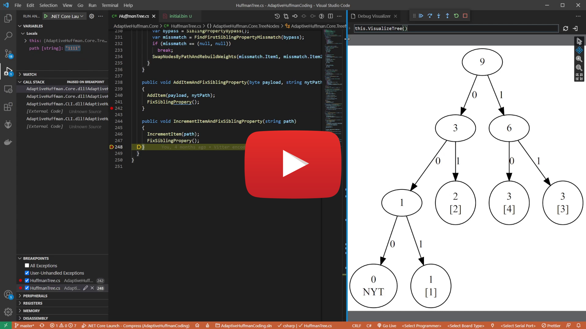

# AdaptiveHuffmanCoding

This project is implementation of Vitter algorithm in C# which is commonly used for lossless data compression. I wrote it using TDD so there are a lot of unit tests in `AdaptiveHuffman.UnitTests`. To make debugging easier I used [VS Code Debug Visualizer](https://github.com/hediet/vscode-debug-visualizer) to visualize tree structure.

---

Adaptive Huffman coding (also called Dynamic Huffman coding) is an adaptive coding technique based on Huffman coding. It permits building the code as the symbols are being transmitted, having no initial knowledge of source distribution, that allows one-pass encoding and adaptation to changing conditions in data.

The benefit of one-pass procedure is that the source can be encoded in real time, though it becomes more sensitive to transmission errors, since just a single loss ruins the whole code.

There are a number of implementations of this method, the most notable are FGK (Faller-Gallager-Knuth) and **Vitter** algorithm.
[
<small>Wikipedia</small>
](https://en.wikipedia.org/wiki/Adaptive_Huffman_coding)

Huffman code is a particular type of optimal prefix code that is commonly used for lossless data compression.
[
<small>Wikipedia</small>
](https://en.wikipedia.org/wiki/Huffman_coding)

---

## Examples

There are three folders `examples/binary/`, `examples/image/`, `examples/text/`. You can run `compress.bat` then `decompress.bat`. Initial and decompressed files will be identical.

Text file from example has been compressed almost twice.

## Debugging with Debug Visualizer

